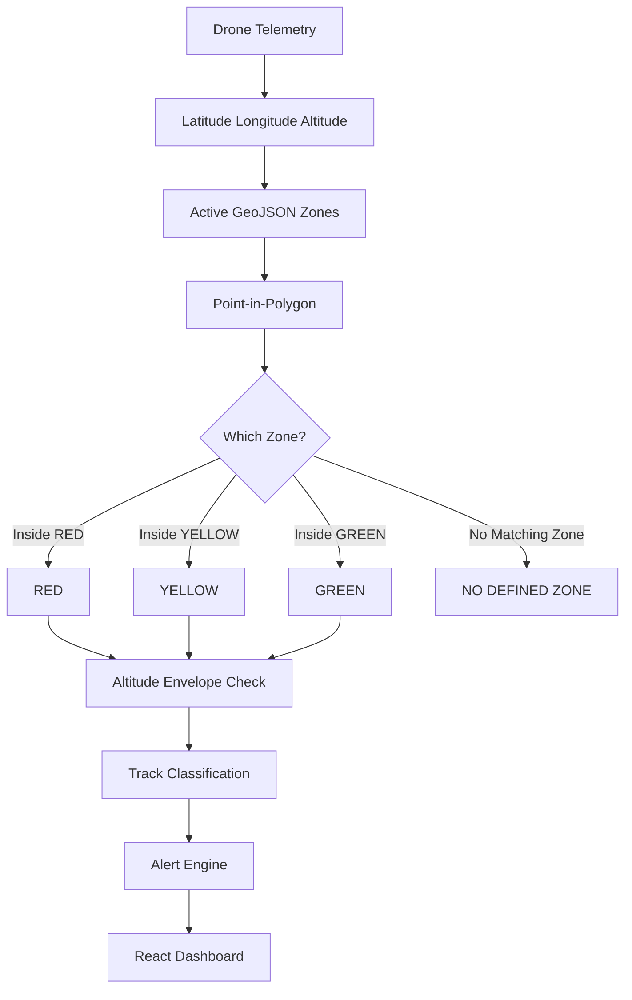

AERIS-C2
--------
Drone Activity Monitoring and Coastal Surveillance Console for Civil Law Enforcement  
Theme: AI for Humanity — Problem Statement No. 3  
Special mention: Megathon - 2026, Saveetha Engineering College (SEC)

One-line summary
----------------
AERIS-C2 is a prototype operator console combining simulated telemetry, geofencing, simple vision demo hooks, and an auditable alert/evidence pipeline for demonstrating drone activity monitoring workflows.

What this is
-------------
AERIS-C2 is a prototype (on‑premise / LAN) tactical console that ingests simulated drone telemetry, evaluates tracks against GeoJSON zones (including altitude envelopes), raises alerts, and provides a React-based operator dashboard. Vision/YOLO components in this repository are demonstrative/mocked — model evaluation is explicitly pending.

Stack
-----
- Languages: Python (backend, simulator), TypeScript / React (frontend), JavaScript (build tooling)
- Frameworks / runtimes: FastAPI-like Python web app (backend invoked as python main.py in the repo), Vite + React frontend
- Notable libraries: Leaflet (map), Vite, TypeScript, (mock) YOLO detector interface in the vision code paths

Repository layout (top-level)
----------------------------
AERIS-C2/
├── main.py                        # Backend entrypoint (FastAPI-like server)
├── telemetry_receiver.py          # Telemetry / WS helper utilities
├── virtual_drone_sender.py        # Python virtual drone simulator (scenarios)
├── test_phase4.py                 # Tests / verification scripts
├── test_phase5.py                 # Full integration/acceptance test script referenced in docs
├── package.json                   # Frontend package + dev scripts (Vite, React)
├── tsconfig.json
├── vite.config.ts
├── src/                           # Frontend source (React + Leaflet UI)
├── static/                        # Static frontend assets (map tiles, styles)
├── dist/                          # Built frontend artifacts (if present)
├── README_AERIS.md                # Existing project README with architecture & quickstart
└── .gitignore

How it fits together
--------------------
- Python backend (main.py) exposes the web UI and WebSocket endpoints for telemetry (/ws/telemetry) and dashboard broadcasting (/ws/dashboard) as described in the project docs.
- A Python virtual drone (virtual_drone_sender.py) connects via WebSocket to the backend and streams simulated telemetry for demo scenarios.
- Frontend is a Vite + React app (package.json, src/) using Leaflet to present a live map, tracks, zones and UI for operator actions.
- GeoJSON zones and an in-memory point-in-polygon engine implement the geofence checks and altitude-envelope checks to produce RED/YELLOW/GREEN/NO_ZONE classification states.
- A simple vision interface and a MockYOLOv8 detector exist for demo correlation between visual observations and telemetry tracks; the vision part is explicitly marked MOCK/DEMO and model evaluation is pending.

Key repository evidence (what is actually implemented)
-----------------------------------------------------
- Backend start: python main.py — README_AERIS.md documents main.py as binding to 0.0.0.0:8000.
- Telemetry simulator: virtual_drone_sender.py supports scenario flags (examples in README_AERIS.md).
- Frontend: package.json with scripts (dev/build/preview) — Vite + React + Leaflet are used.
- Telemetry + dashboard communication: WebSocket-based flows described in README_AERIS.md and reflected by WS URIs used by the simulator examples (ws://<HOST>:8000/ws/telemetry).
- Alerts & audit export: README_AERIS.md documents an append-only audit log and export endpoints (CSV/JSON) — these endpoints are declared in the docs and used by tests.
- Vision: a MockYOLO detector and a "Track A Vision" demo component are present; model evaluation is NOT provided (status: Model evaluation pending; mock/demo mode).

What is explicitly MOCK / DEMO / NOT implemented
------------------------------------------------
- Vision geolocation / camera-to-GPS calibration: NOT implemented (vision detections are uncalibrated; correlation is temporal/probabilistic only).
- Real-world registry: simulated/demo registry only — NOT a live government DB.
- Production hardened features (RBAC, persistence to production DB, authentication for operators, hardened scaling) are FUTURE WORK / not included.
- Measured ML metrics (precision/recall) are UNMEASURED — model evaluation pending.

System architecture (conceptual)
-------------------------------
Mermaid-style (conceptual)
```mermaid
flowchart LR
  VP[Python Virtual Drone Simulator] -->|WebSocket /ws/telemetry| BE[AERIS-C2 Backend (main.py)]
  BE --> TrackEngine[Track Manager / Canonical State]
  TrackEngine --> Geofence[GeoJSON Zone Engine (PIP + Altitude)]
  Geofence --> AlertEngine[Alert Engine / Deduplication]
  AlertEngine --> Audit[Append-Only Audit Log & Export]
  BE -->|WebSocket /ws/dashboard| FE[React Dashboard (src/)]
  BE --> Vision[Vision/MockYOLO]
  Vision --> Correlation[Correlation Layer]
  Correlation --> TrackEngine
```

Complete data flow (working pipeline)
------------------------------------
- Telemetry flow:
  Python virtual drone → WebSocket (/ws/telemetry) → backend (main.py) → track manager → geofence engine → alert engine → websocket broadcast to React dashboard.
- Vision flow (demo):
  Video frame → Mock YOLO detector → vision observation (bbox, confidence, marked as mock) → optional temporal correlation with telemetry tracks → shown in camera panel in UI.
- Operator flow:
  Operator views dashboard → interacts (select/drag simulated drones, draw zones, declare zones, disposition alerts) → backend records actions in audit log and updates tracks/alerts.

How RED / YELLOW / GREEN zone detection works (implemented)
-----------------------------------------------------------
1. Backend receives telemetry with latitude, longitude, altitude (simulated).
2. Convert position to a geographic point and test against active GeoJSON zone polygons (point-in-polygon).
3. If point is inside a RED polygon → current zone = RED; similarly for YELLOW and GREEN.
4. If no zone contains the point → NO_DEFINED_ZONE (or repo’s equivalent).
5. Backend checks altitude against configured min/max altitude envelope for the zone.
6. Backend sets track classification and passes it to alert engine to decide whether to raise or update an alert.

Mermaid flow used in docs:


Telemetry format (prototype)
---------------------------
Typical telemetry fields used by the prototype (simulated):
- drone_id
- timestamp (ISO8601)
- latitude
- longitude
- altitude
- speed
- heading

Virtual drone / two-laptop demo
-------------------------------
- Laptop 1: runs backend + React dashboard (python main.py and open http://localhost:8000).
- Laptop 2: runs python virtual_drone_sender.py connecting to Laptop 1’s WS telemetry endpoint (examples in README_AERIS.md).
- Example simulator commands (from repo docs):
  python virtual_drone_sender.py --uri ws://<LAPTOP_1_IP>:8000/ws/telemetry --scenario-1
  python virtual_drone_sender.py --uri ws://<LAPTOP_1_IP>:8000/ws/telemetry --demo-all --multi

Track & registry
----------------
- Track vs drone: a track is the system’s current observation/state for a drone in the canonical track manager. Tracks include fields such as track_id, drone_id, position, altitude, speed, heading, first_seen, last_seen, telemetry_source, and authorization state.
- Registry: a simulated registry in the code provides demo registration/authorization state. REGISTERED/AUTHORISED vs UNREGISTERED distinction is simulated.

Alert engine & canonical classifications
----------------------------------------
Implemented canonical states (documented in the repo):
- AUTHORISED — matched to simulated registry + within envelope
- UNREGISTERED — no registry match
- OUT_OF_ENVELOPE — violation of zone or altitude limits
- LOST_LINK — telemetry absent for a configured timeout

Deduplication / alerts
----------------------
The code and docs describe an alerting approach that avoids unlimited duplicates: zone entry generates an alert, continued presence updates the state, exit triggers state change and potential new events. The repository includes test scripts that validate those behaviours.

Vision + YOLO
-------------
- The repo contains a vision detector interface and a MockYOLOv8 detector for demonstration.
- Vision observations include bbox, confidence and are marked as is_mock = true.
- Model evaluation is pending; the vision component is a demonstration and does not provide geolocation (no camera calibration/geo‑referencing implemented).

Evidence & audit
----------------
- The backend records operator actions and system events to an append-only audit log and supports CSV/JSON export as documented (GET /api/audit/export?format=csv and ?format=json are shown in project docs).
- Evidence records combine available telemetry, track, zone and operator action fields; camera/frame references are only included if actually present (vision is mocked in the repo).

API surface (as documented in repo README)
------------------------------------------
The project README documents WebSocket endpoints for telemetry and dashboard, and REST endpoints used by vision, audit export and retention. Use the server root (python main.py binds to 0.0.0.0:8000 in docs) to explore actual routes (e.g., open http://localhost:8000/docs if FastAPI OpenAPI is enabled by main.py).

How to run this project (from inspected docs)
---------------------------------------------
Prerequisites:
- Python 3.x (the repo uses Python scripts; ensure a modern 3.10+ is available)
- Node 18+ / npm for the frontend (package.json + Vite)

Quick start (minimal path seen in repo docs)
1. Clone repository:
   git clone https://github.com/vmit-1911/AERIS-C2.git
   cd AERIS-C2
2. Backend:
   python main.py
   # Backend is documented to bind 0.0.0.0:8000
3. Frontend (in another terminal, if developing UI):
   npm install
   npm run dev
   # Or use the backend-served UI if the backend bundles the frontend in production mode
4. Simulator (Laptop 2 in demo):
   python virtual_drone_sender.py --uri ws://<BACKEND_HOST>:8000/ws/telemetry --scenario-1

Run tests:
- python test_phase5.py  # referenced in README_AERIS.md as full acceptance test (integration)

Project limitations (be explicit)
--------------------------------
- Telemetry and registry data are simulated/demo only.
- Vision detection is a mock/demo — no calibrated geolocation from camera imagery.
- No production-grade authentication/authorization or persistence guarantees are present.
- Performance targets listed in the docs (e.g., telemetry latency ≤ 2s) are stated as targets, not measured results.

Future work (high-level)
------------------------
- Integrate real telemetry sources and authenticated registries (FUTURE WORK).
- Calibrated multi-camera geolocation and measured model evaluation (FUTURE WORK).
- Production DB, RBAC and hardened deployment (FUTURE WORK).

5-minute jury demonstration (short)
-----------------------------------
1. Start backend (python main.py) and open the dashboard on Laptop 1.
2. Start virtual_drone_sender.py on Laptop 2 pointing to Laptop 1’s WS.
3. Show a track moving on the map, select the drone and open its details.
4. Draw and declare a temporary RED zone; drag a simulated drone into it (or run a scenario).
5. Observe alert generation, evidence/audit creation and export on the dashboard.
6. Optionally show the mock YOLO detection panel (vision is demo/mock).

License & credits
-----------------
- License: Not yet specified in the repository (no top-level LICENSE file found).
- Team: AERIS-C2 Development Team
- Special note: Megathon - 2026, Saveetha Engineering College (SEC)

Troubleshooting pointers (from repo docs)
----------------------------------------
- Backend not starting: ensure Python version, check for missing package imports and run python main.py from project root.
- WebSocket failures: confirm the backend host/port, ensure firewall rules allow LAN connections, use the same protocol (ws://).
- Frontend issues: run npm install then npm run dev; ensure Vite runs on expected port and that the frontend is pointed at the backend WS endpoints.
